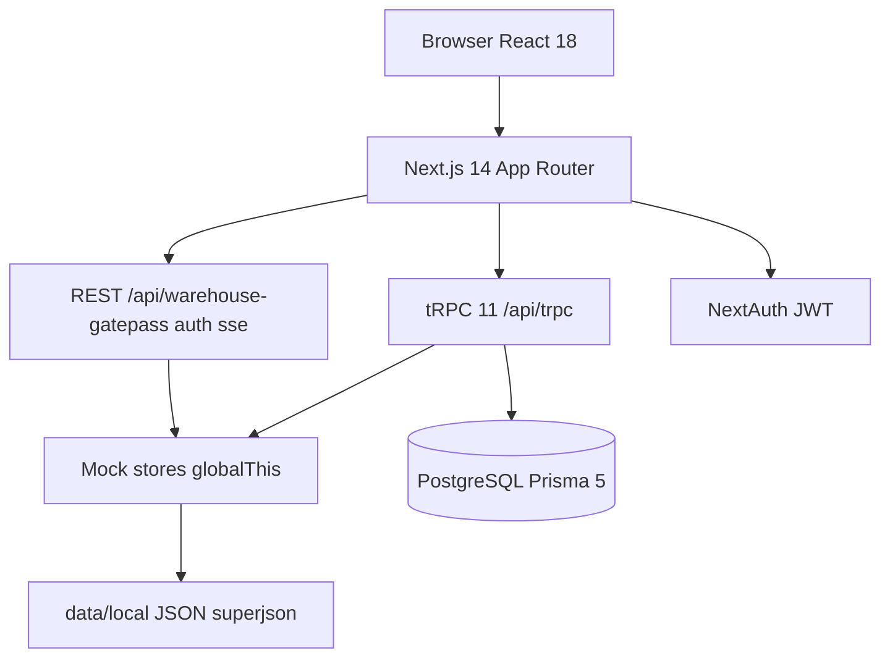

# 01 — Architecture

---

## System diagram



---

## Tech stack

| Layer | Package |
|-------|---------|
| Framework | next@14.2 |
| UI | react@18, tailwindcss@3, lucide-react |
| API | @trpc/server@11, superjson |
| Data | @prisma/client@5.22 |
| Auth | next-auth@4 |
| Forms | react-hook-form, zod@4 |
| State | @tanstack/react-query via tRPC |
| Charts | recharts |
| Export | xlsx, jspdf |

---

## Dual persistence model

**Critical for recreation:** trader booking and execution run on mock JSON stores by default, even though Prisma schema exists.

| Trigger | Storage |
|---------|---------|
| `MOCK_MODE=true` or `SKIP_DATABASE=true` | Mock + JSON |
| `MOCK_MODE` false + `DATABASE_URL` set | Prisma PostgreSQL |

Gate: `server/mock-mode.ts` → `isMockMode()`.

### Mock path (operational)

| Store | Module | Disk file |
|-------|--------|-----------|
| Booked trades | `server/dummy-data.ts` | booked-trades.json |
| Execution state | `server/execution/runtime.ts` | execution-state.json |
| Master data | `server/trader-master-data.ts` | master-data.json |
| Change requests | `server/change-requests-store.ts` | change-requests.json |
| Market prices | `server/market-prices.ts` | market-prices.json |
| Position adj | `server/position-ledger.ts` | position-adjustments.json |

Persistence: `server/local-persist.ts` — superjson read/write, atomic rename.

In-memory: `globalThis` keys (e.g. `__kastrosBookedRuntime`) with disk sync on mutate.

### DB path (analytics)

Routers that query Prisma when not mock: `positions`, `mtm`, `inventory`, `reports`, `traceability`, `shipments`, `cashflow`, `reconciliation`, `supplyChain`, `commodity`.

Trader/execution mutations remain mock-backed in current implementation.

---

## Directory layout

```
kastros-ctrm/
├── app/                    # Next.js App Router pages + API routes
│   ├── (trader)/           # Trader workspace
│   ├── (execution)/        # Execution workspace
│   ├── (ceo)/              # CEO workspace
│   ├── (dashboard)/        # Control tower
│   ├── (finance)/          # Finance pages
│   ├── (auth)/             # Login
│   └── warehouse/          # Public gatepass
├── components/             # React UI by feature
├── lib/                    # Domain logic (pure functions)
├── server/                 # tRPC routers, stores, persistence
│   ├── routers/            # 17 tRPC routers
│   ├── execution/          # Contracts, trucks, movements
│   └── trpc/               # Context, procedure guards
├── prisma/                 # Schema + migrations + seed
├── data/local/             # Runtime JSON (gitignored typically)
└── docs/                   # This documentation
```

---

## Request flow

1. Browser calls tRPC via `@trpc/react-query` (`lib/trpc/client.ts`)
2. `app/api/trpc/[trpc]/route.ts` → `appRouter` (`server/routers/_app.ts`)
3. Procedure guard checks session role/head
4. Handler reads/writes mock store or Prisma
5. superjson serializes response (Dates preserved)

REST gatepass bypasses tRPC — `app/api/warehouse-gatepass/route.ts` calls execution store directly.

---

## Layout system

Viewport-locked desk — no page scroll; scroll inside panels.

| Class | Purpose |
|-------|---------|
| `kastros-desk-host` | Flex column filling main |
| `kastros-desk-host-scroll` | Fallback scroll wrapper (app-shell) |
| `kastros-desk-page` | Page flex column |
| `kastros-desk-scroll` | Scrollable content region |
| `kastros-table-wrap` | Table-only scroll with sticky thead |

Components: `components/layout/app-shell.tsx`, `desk-page.tsx` (DeskPage, DeskScroll, DeskPanel).

Standalone scroll: `(auth)/layout.tsx`, `warehouse/layout.tsx` use `h-dvh overflow-y-auto`.

---

## Brand / theme

CSS variables in `app/globals.css` — brand blue `#2D3E9B`, green `#0F733C`. Dark mode via `next-themes`.

---

## Key integration points

| Concern | Entry |
|---------|-------|
| tRPC root | `server/routers/_app.ts` |
| Auth | `lib/auth.ts`, `app/api/auth/[...nextauth]/route.ts` |
| Trade book | `server/dummy-data.ts` |
| Lock/fulfill | `server/execution/contracts.ts` |
| Approvals | `server/change-requests-store.ts`, `change-request-apply.ts` |
| Constants | `lib/trade-constants.ts` |

---

## Related

- [11-persistence-and-seeding.md](./11-persistence-and-seeding.md)
- [02-data-model.md](./02-data-model.md)
- [09-api-reference.md](./09-api-reference.md)
