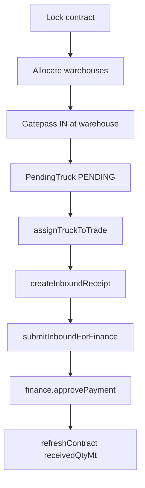
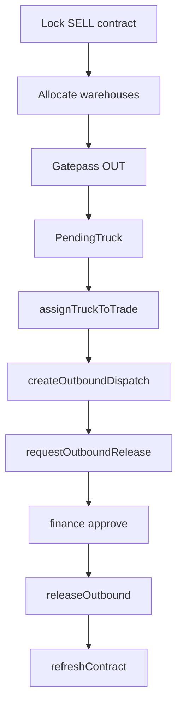

# 05 — Execution Profiles

Three execution profiles assigned at **lock** based on direction and incoterm.

**Routing** (`lib/trade-constants.ts`):

```
SELL → SALE_EX_WAREHOUSE
BUY + incoterm === "Spot" → PURCHASE_SPOT
BUY + other incoterm → PURCHASE_DELIVERED
```

---

## Profile comparison

| Profile | Direction | Incoterm | Warehouse gatepass | Primary fulfillment |
|---------|-----------|----------|-------------------|---------------------|
| PURCHASE_DELIVERED | BUY | Delivered, EXW, etc. (not Spot) | INBOUND | Inbound receipts |
| PURCHASE_SPOT | BUY | Spot | No (spot pipeline) | Spot state RECEIVED |
| SALE_EX_WAREHOUSE | SELL | Ex-Warehouse, etc. | OUTBOUND | Outbound dispatches |

Desk pages: `components/execution/purchase-delivered-desk.tsx`, `purchase-spot-desk.tsx`, `sales-desk.tsx`  
Scoped routes: `/execution/{local|international}/purchase-delivered`, `purchase-spot`, `sales`  
Detail pages: `/execution/purchase-delivered/[ref]`, `purchase-spot/[ref]`, `sales/[ref]`

---

## PURCHASE_DELIVERED pipeline



### Key procedures

| Step | tRPC |
|------|------|
| List open contracts | `execution.lockedContracts` (profile filter) |
| Pending trucks | `execution.pendingTrucks` |
| Assign truck | `execution.assignTruckToTrade` |
| FIFO auto-assign | `execution.assignTruckFifoAuto` |
| Create receipt | `execution.createInboundReceipt` |
| Submit to finance | `execution.submitInboundForFinance` |
| Approve payment | `finance.approvePayment` or `execution.approvePayment` |

### InboundReceipt statuses

`DRAFT` → `ALLOCATED` → `FINANCE_PENDING` → `PAID`

Only non-DRAFT receipts count toward `receivedQtyMt`.

---

## PURCHASE_SPOT pipeline

Spot trades skip warehouse gatepass. State machine on `SpotPurchaseEvent`:

```
CONTRACT → SELECTED → LOADED → DC_ISSUED → INVOICED → FINANCE_PENDING → PAID → ON_THE_WAY → RECEIVED
```

### Key procedure

`execution.advanceSpot` — transitions state with optional broker, DC, truck, weights, invoice fields.

### Fulfillment

When `state === RECEIVED` and `warehouseReceiveWeightKg` set:

```
spotReceiveQty = kgToQuantityUnit(warehouseReceiveWeightKg, quantityUnit)
```

Counts toward BUY fulfillment and auto-close threshold.

Detail UI: `app/(execution)/execution/purchase-spot/[ref]/page.tsx` — pipeline steps, broker/invoice fields.

---

## SALE_EX_WAREHOUSE pipeline



### OutboundDispatch statuses

`AT_GATE` → `WEIGHED` → `FINANCE_PENDING` → `RELEASED`

Non-AT_GATE dispatches count toward SELL fulfillment.

### FIFO

`execution.suggestSaleFifo` — suggests contract allocation order for sales.

---

## Payment requests

**Type:** `PaymentRequest` in execution runtime  
**Sources:** INBOUND, OUTBOUND, SPOT  
**Statuses:** PENDING → APPROVED / REJECTED

Finance desk: `/finance/payments` — `finance.pendingPayments`, `approvePayment`, `rejectPayment`.

Spot submit: `execution.submitSpotForFinance`.

---

## Contract refresh (all profiles)

**Function:** `refreshContract(tradeRef)` in `server/execution/contracts.ts`

On each fulfillment event:

1. `receivedQtyMt = getFulfilledQtyForTrade(tradeRef)`
2. `openQtyMt = max(0, contractualQtyMt − receivedQtyMt)`
3. Update warehouse allocation progress per WH
4. If `shouldAutoCloseContract` → `contractStatus = Close`, trade → EXECUTED
5. Persist execution-state.json

---

## Manual truck allocation

**Component:** `components/execution/manual-truck-allocation.tsx`  
Used on profile desk pages — assign pending trucks to open contracts with weight override.

---

## Trade files export

`execution.exportTradeFileCsv`, `trader.exportTradeFile` — filtered trade exports for desk reporting.

---

## Related

- [06-warehouse-and-gatepass.md](./06-warehouse-and-gatepass.md)
- [08-formulas-and-calculations.md](./08-formulas-and-calculations.md) — fulfillment formulas
- [04-trade-lifecycle.md](./04-trade-lifecycle.md)
