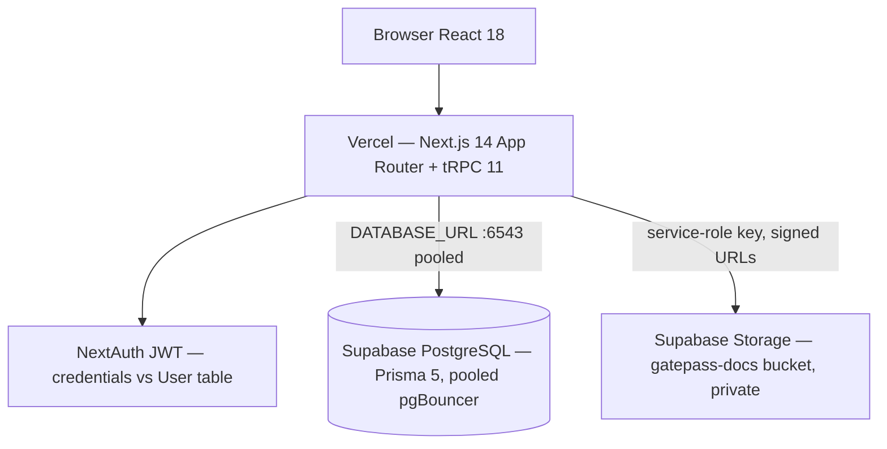

# 12 — Supabase + Vercel Deployment

The system is deployed as: **Next.js frontend + tRPC API on Vercel** (serverless) and **PostgreSQL + file Storage on Supabase**. The former mock JSON runtime is fully replaced by relational tables — see `prisma/schema.prisma`.

---

## Architecture



- **All** database access goes through Prisma on the server (tRPC routers + REST routes). The Supabase anon/REST API is not used; RLS is enabled on every table with no policies, so leaked anon keys expose nothing.
- Business-reference sequences (trade refs, KCS numbers, gatepass numbers, CR ids) come from the `RefCounter` table via an atomic `INSERT … ON CONFLICT … RETURNING` — concurrency-safe across serverless instances.
- Fulfillment recomputation (`refreshContract`) and truck assignment run inside Postgres transactions with `SELECT … FOR UPDATE` row locks so simultaneous operators cannot double-allocate.

## Supabase project

| Item | Value |
|------|-------|
| Project | `katros-erp` (`qyvdpbkxqgqyzuwpynpd`), region `ap-south-1` |
| Migrations applied | `init_enums`, `init_tables`, `init_indexes_fks`, `enable_rls_all_tables` (mirrors `prisma/migrations/0_init`) |
| Storage bucket | `gatepass-docs` — private, 10 MB limit, PDF/JPEG/PNG/WebP |

### Connection strings

Get the database password from **Supabase Dashboard → Project Settings → Database**. Then:

- `DATABASE_URL` (app, pooled): `postgresql://postgres.qyvdpbkxqgqyzuwpynpd:<password>@aws-0-ap-south-1.pooler.supabase.com:6543/postgres?pgbouncer=true&connection_limit=1`
- `DIRECT_URL` (migrations): same host, port `5432`, no pgbouncer params.

`connection_limit=1` per serverless function instance + pgBouncer transaction pooling is the recommended Prisma-on-Vercel setup.

## Vercel setup

1. Import the GitHub repo into Vercel (framework: Next.js — zero config; `npm run build` already runs `prisma generate`).
2. Set Environment Variables (all environments):
   - `DATABASE_URL`, `DIRECT_URL` (above)
   - `NEXTAUTH_SECRET` (`openssl rand -base64 32`)
   - `NEXTAUTH_URL` = the deployment URL (e.g. `https://katros-erp.vercel.app`)
   - `SUPABASE_URL` = `https://qyvdpbkxqgqyzuwpynpd.supabase.co`
   - `SUPABASE_SERVICE_ROLE_KEY` (Dashboard → Project Settings → API — server-only secret)
   - `SUPABASE_STORAGE_BUCKET` = `gatepass-docs`
   - Do **not** set `MOCK_MODE` in production.
3. Deploy. The public gatepass form (`/warehouse/gatepass`) and login page are available immediately.

## Database workflows

| Task | Command |
|------|---------|
| Apply schema changes | edit `prisma/schema.prisma` → `npx prisma migrate dev` (locally against `DIRECT_URL`) → commit migration → `npx prisma migrate deploy` in CI/Vercel build or via Supabase MCP |
| Seed demo users + master data | `npm run db:seed` (idempotent upserts) |
| Wipe operational data | `npm run data:reset` (truncates trades/execution/approvals, keeps users + master data) |

### Seeded logins (password `Kastros123!`)

`admin@`, `ceo@`, `trader@`, `traderhead@`, `execution@`, `executionhead@`, `finance@`, `financehead@`, `risk@`, `viewer@` — all `…@kastros.com`. Department-head rights come from the `User.isHead` column (no longer inferred from the email).

## Concurrency model (multi-user)

| Concern | Mechanism |
|---------|-----------|
| Unique business refs | `RefCounter` atomic upsert-returning |
| Trade ref / gatepass no. uniqueness | DB `UNIQUE` constraints (`Trade.tradeRef`, `PendingTruck.gatepassNo`, `InboundReceipt.kcsNo`, …) |
| Truck double-assignment | `FOR UPDATE` locks on truck + contract inside one transaction |
| Contract auto-close race | `refreshContract` recomputes under a contract row lock |
| Approval double-resolution | guarded `updateMany` state transitions (`PENDING → APPROVED/REJECTED`) |
| Cross-entity integrity | Foreign keys with explicit `ON DELETE` behavior (see `prisma/schema.prisma`) |

## Relationships overview

Core graph (business-key FKs in *italics*):

- `User 1—n Trade` (createdBy) · `Commodity 1—n Trade` · `Counterparty 1—n Trade`
- `Trade 1—1 ExecutionContract` (created at lock) `1—n ContractWarehouseAllocation n—1 Location`
- `Trade 1—n TradeActivity` (audit log) · `ChangeRequest 1—n TradeActivity`
- *`Trade.tradeRef`* ← `InboundReceipt`, `OutboundDispatch`, `SpotPurchaseEvent` (1—1), `PaymentRequest`, `PendingTruck.assignedTradeRef`, `PendingTruck.gateInvoiceTradeRef`
- *`PendingTruck.gatepassNo`* ← `GatepassDocument` (cascade), `InboundReceipt`, `OutboundDispatch`
- `PaymentRequest 1—n` inbound/outbound/spot back-references (`paymentRequestId`)
- `Commodity.code` ← `DeskMarketPrice` (1—1 live desk mark), `PositionAdjustment`
- Analytics: `Position/PositionLeg/MTMValue/Inventory/Invoice/Payment/...` unchanged from Phase 1.

## Local development

```bash
cp .env.example .env       # fill in Supabase credentials
npm install                # runs prisma generate
npm run db:seed            # once
npm run dev
```

Without Supabase credentials, set `MOCK_MODE=true` for demo logins; Storage uploads fall back to `data/local/`.
